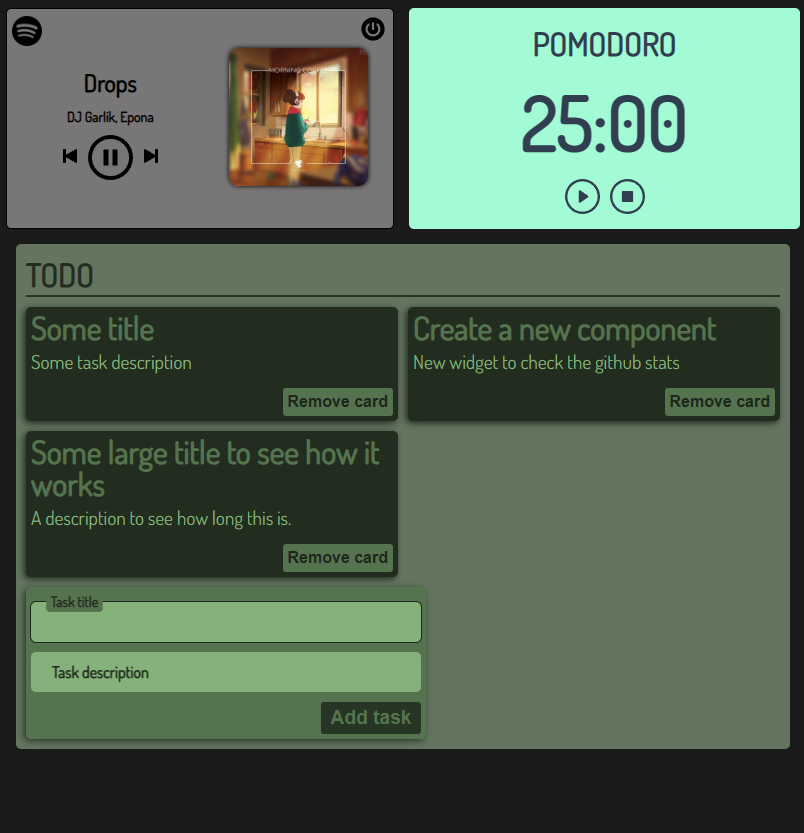

# Workboard :)

A simple project to play/learn VUE 3

## Current widgets implemented:
- Spotify controller
- Pomodoro timer
- To-do list

*The Spotify controller is in "Development mode", so only whitelisted users can use it at the moment.

## How it looks at the moment
